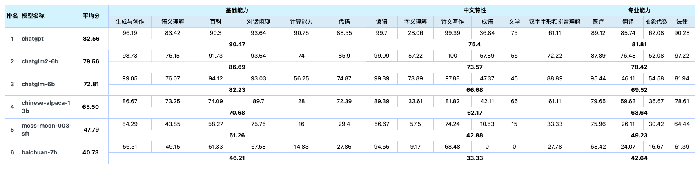
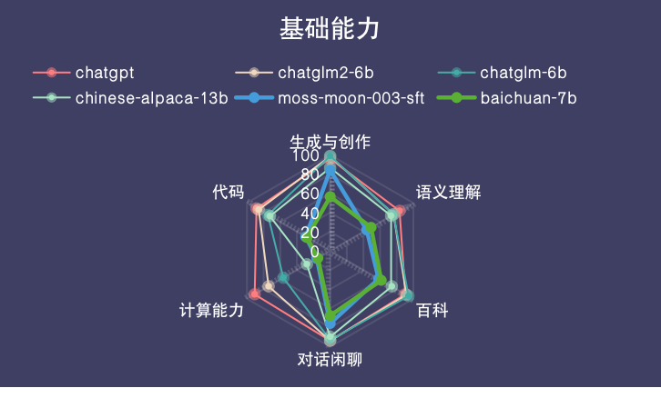
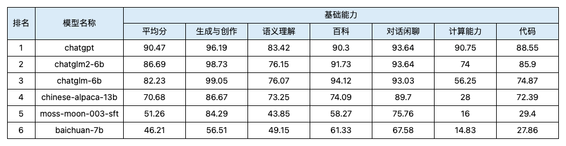
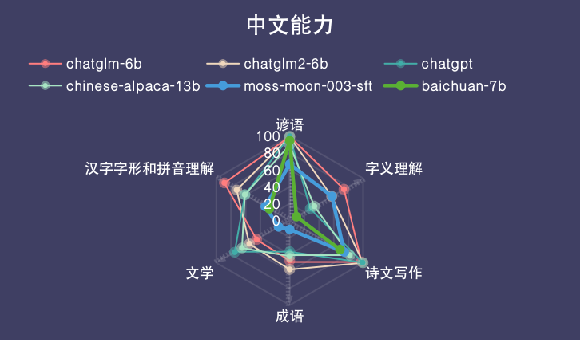
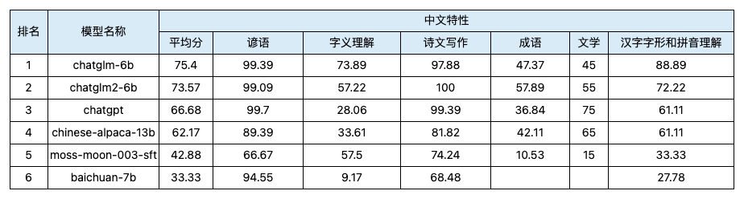
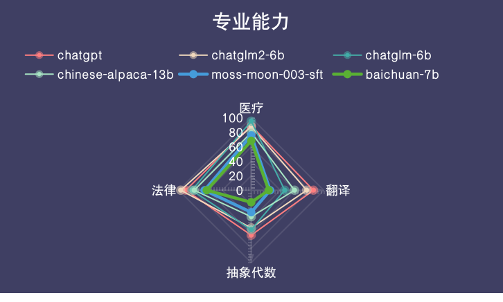
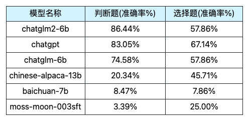

[中文](README.md)
# Table of Content


* [Introduction to LLM Auto-Evaluation by Tesaifa](#Introduction-to-LLM-Auto-Evaluation-by-Tesaifa)
  * [Purpose of Auto-Evaluation](#Purpose-of-Auto-Evaluation)
  * [Dimensions of Auto-Evaluation](#Dimensions-of-Auto-Evaluation)
  * [Methodology of Auto-Evaluation](#Methodology-of-Auto-Evaluation)
  * [Future Work](#Future-Work)
* [The Main Results of LLM Auto-Evaluation by Tesaifa - Phase 1](#The-Phase-1-Main-Results-of-LLM-Auto-Evaluation-by-Tesaifa)
* [Explanation of Experimental Script](#Explanation-of-Experimental-Script)
  * [Construction and Selection of Prompts](#Construction-and-Selection-of-Prompts)
  * [Automated Inference Script for LLMs](#Automated-Inference-Script-for-LLMs)
  * [Auto-Evaluation of Subjective Questions Conducted by ChatGPT](#Auto-Evaluation-of-Subjective-Questions-Conducted-by-ChatGPT)
  * [Normalization of Auto-Evaluation Results](#Normalization-of-Auto-Evaluation-Results)
  


# Introduction to LLM Auto-Evaluation by Tesaifa

## Purpose of Auto-Evaluation

Most current evaluations of LLMs are primarily focused on two aspects. The one is, traditional Natural Language Understanding (NLU) tasks such as semantic understanding and sentiment analysis, or traditional NLP metrics. On the other hand, there are evaluations that aim for closer alignment with human performance through large-scale authoritative tests. However, in real-life applications, what matters more is the practical utility of Chinese LLMs. That is, whether these LLMs have the capability to assist humans in solving specific tasks. With this in mind, we have designed an evaluation for Chinese LLMs, creating a dataset that measures the "「**usability**」" of the model.

## Dimensions of Auto-Evaluation
In the evaluation process, we place a strong emphasis on the practical utility of these LLMs, which is divided into three key aspects:
- **Problems Solving Capability**: When assessing the utility of a model, the first aspect to consider is its performance in addressing real-world problems. Can the model generate accurate and useful results? Is it capable of meeting user needs or providing effective recommendations?
- **Real-world Data**: Evaluations are conducted using real-world datasets to test the model's performance, as opposed to idealized data. This ensures that the model's performance aligns with real-world applications.
- **Diversity and Versatility**: Model evaluations should encompass a wide range of application scenarios to validate the model's applicability. Models need to exhibit the ability to generalize and perform well across various contexts, not just in specific scenarios.

Therefore, we have delineated the model's capabilities into three major categories: **Fundamental Capabilities**, **Chinese-specific Features**, and **Specialized Capabilities**. Within each of these primary categories, we have further established several subcategories as the criteria for constructing our evaluation dataset.

Please click on [Overview of LLM Auto-Evaluation Dataset by Tesaifa](dataset_public/特赛发LLM评测第一期数据集概要.csv) for more details.
## Methodology of Auto-Evaluation
Due to time constraints, the first phase of the evaluation primarily assessed five Chinese LLMs. Additionally, we included the text-davinci-003 model as benchmark for comparison, which is referred to as ChatGPT. The evaluation methodology involved using accuracy for objective questions and adopting a method where LLM acted as evaluator for open-ended subjective questions.
## Future Work
Our evaluation currently has several limitations, but we will continue to work on improving and optimizing the evaluation system and result presentation. This includes, but is not limited to:
1. Expanding and refining the dataset, while accommodating more large models in the Chinese language domain for evaluation.
2. Incorporating human evaluations to ensure the accuracy of results and exploring how model evaluations can align with human evaluations.
3. Enhancing our result analysis, such as providing a more objective representation of the bias introduced by human or model evaluator preferences.

  

# The Phase 1 Main Results of LLM Auto-Evaluation by Tesaifa
The main results are as follows, for detailed results, please click on [The results of the initial round of LLM Auto-evaluation by Tesaifa](dataset_public/eval_output/特赛发LLM第一轮评测结果.pdf)
## Results of Overall Three Capabilities

### Results of Detailed Subcategories for Fundamental Capabilities


### Results of Detailed Subcategories for Chinese-specific Features


### Results of Detailed Subcategories for Specialized Capabilities


## Results for Objective and Subjective Questions
### Accuracy of Objective Questions

### Scores of Subjective Questions
- **Normalized Scores for ChatGPT Ranking Across Three Dimensions (Fluency, Effectiveness, Reliability)**  


- **Normalized Scores for ChatGPT Scoring Across Three Dimensions (Fluency, Effectiveness, Reliability)**  


# Explanation of Experimental Script

The current repository primarily includes the following sections

## Construction and Selection of Prompts
Taking inspiration from benchmark datasets like Gaokao, the construction of the evaluation questions roughly categorizes them into four types: judgment questions, multiple-choice questions, open-ended questions, and reasoning questions. Specific instructions are adapted based on the category, and after offline experiments, instructions that yield better output results are selected for the evaluation output.

For more details, please refer to ```src/prompt```。

## Automated Inference Script for LLMs
Currently, script supports inference of llama|moss|glm|baichuan|gptq models based on the HuggingFace Framework. Specifically, [vLLM](https://github.com/vllm-project/vllm) framework and [fastllm](https://github.com/ztxz16/fastllm) framework will be involved to conduct high-efficiency inference on Llama and ChatGLM. Also, We plan to extend compatibility to more high-efficiency inference frameworks in the future.
- **Usage Instruction**
```
python llm_inference.py --model_name chatglm /
 --model_path your_model_path /
 --model_type [llama|moss|glm|baichuan|gptq] /
 --data_path your_data_path /
 --device 0  /
 --temperature 0 --top_p 1 --top_k 100 --rep_penalty 1.1 /
 --use_fastllm (optional for chatglm only) 
```

## Auto-Evaluation of Subjective Questions Conducted by ChatGPT
We assess ChatGPT's responses to subjective questions across three dimensions: **Effectiveness, Reliability, and Fluency**. Drawing inspiration from the work [RankGPT](https://github.com/sunnweiwei/RankGPT) (2023, Sunweiwei, et.al) and the model evaluation efforts at Fudan University [llm-eval](https://github.com/llmeval/llmeval-1) (2023), we have adopted two primary evaluation approaches: RankingGPT and ScoringGPT.
- **RankingGPT**: Based on the three dimensions mentioned above, we instruct ChatGPT to rank responses from all LLMs for a given question, including the manually set reference answers, with rankings from 1 to 7.
- **ScoringGPT**: Also utilizing the three dimensions, we instruct ChatGPT to assign scores to subjective responses for each LLM. Each dimension is scored from 1 to 3, with specific criteria defined for each score. Models are to consider the reference answer as receiving a perfect score (3, 3, 3).

For more details, please refer to ```scr/eval_agent```，For usage examples, please refer to ```auto-eval-with-chatgpt-examples.ipynb```。

## Normalization of Auto-Evaluation Results
- **Scoring Results Normalization**: Starting at the level of primary or secondary categories, we set a full score of 100 points for each primary or secondary category and allocate scores to each question in proportion. For objective questions, the full score is awarded if the answer is correct. For subjective questions, we consider the importance of the three dimensions (Effectiveness, Reliability, Fluency) in different categories, and weight the ScoringGPT scores accordingly. The final total score is the sum of both scores.
- **Ranking Results Normalization**: Ranking results correspond to subjective questions, and we assign different weights to different ranks, with the first rank having the highest weight and decreasing for subsequent ranks. We also normalize the results based on frequency, ultimately yielding a normalized score.

Please refer to the calculation process and ranking normalization formula in ```metrics_calculation.ipynb```